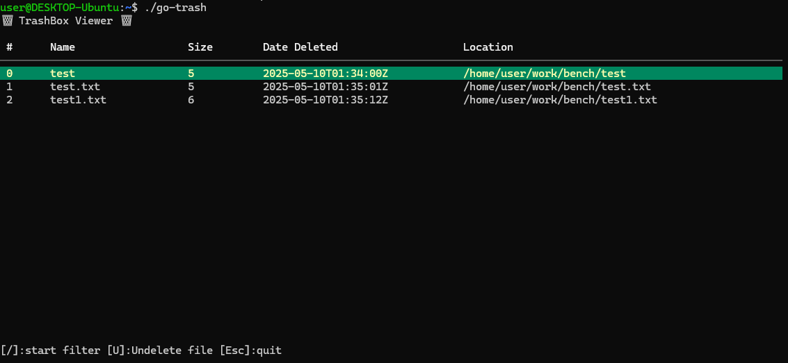
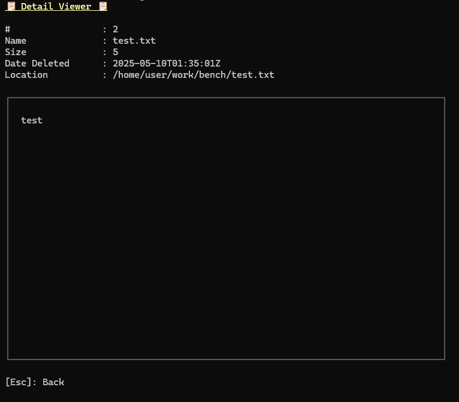
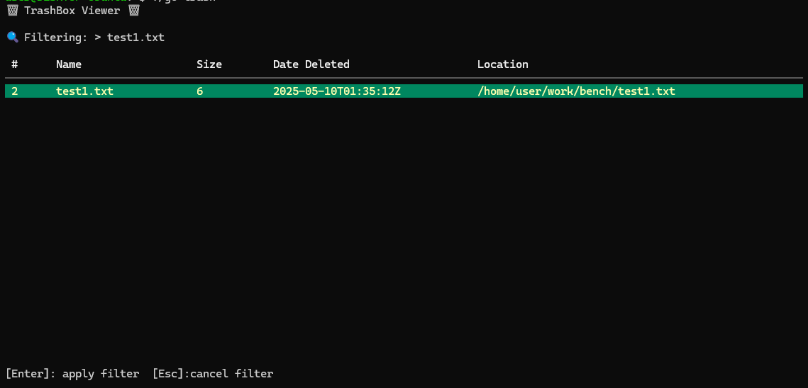

# go-trash
The `go-trash` is simple CLI, that move files and folder to the trashbox written in Go.
Works on Linux and Windows 11.

# Usage
```
$ ./go-trash -h
Usage: go-trash [-hlt] [-o File] [-u File] [parameters ...]
 -h       Show help
 -l       List trashed files
 -o File  Output file to location
 -t       Run TUI mode
 -u File  Restore files to original location
```

## TUI 
### Display mode
Display the contents of the trash  (~/.local/share/Trash)


Press `Enter` toggle to detail mode
TBD: Preview file


### Undelete
Press `U` to undelete file to its original location.

### Fileter
Press `/` to display filter.



## CUI 
### Trash
* Windows
```
C:\Users\user\Desktop> go-trash.exe aaa.txt bbb_dir
```

* Linux
```
~$ ./go-trash aaa.txt bbb_dir
```

### Print list trashed files
* Windows
```
C:\Users\user\Desktop> go-trash.exe -l

🗑️ TrashBox 🗑️

FileName    : aaa.txt
Location    : C:\Users\user\Desktop\aaa.txt
InTrashBox  : C:\$RECYCLE.BIN\S-xxx\$RABCD.txt
DateDeleted : 2023/1/2 12:34:56
Size        : 1234

FileName    : bbb_dir
Location    : C:\Users\user\Desktop\bbb_dir
InTrashBox  : C:\$RECYCLE.BIN\S-xxx\$R1C0U4Q
DateDeleted : 2023/1/2 12:34:56
Size        : 0
```

* Linux
```
~$ ./go-trash -l

🗑️ TrashBox 🗑️

FileName    : aaa.txt
Location    : /home/user/aaa.txt
InTrashBox  : /home/user/.local/share/Trash/files/aaa.txt
DateDeleted : 2023-01-23T12:34:56
Size        : 1234

FileName    : bbb_dir
Location    : /home/user/bbb_dir
InTrashBox  : /home/user/.local/share/Trash/files/bbb_dir
DateDeleted : 2023-01-23T12:34:56
Size        : 0
```


### Restore files
If only one file or directory exists, restore it

* Windows 
```
C:\Users\user\Desktop> go-trash.exe -u aaa.txt
Restore         : C:\Users\user\Desktop\aaa.txt
```

* Linux
```
~$ ./go-trash -u bbb_dir
Restore: /home/user/bbb_dir
```


If more than one file exists, restore the file with the selected 'ID'
* Windows 
```
C:\Users\user\Desktop> go-trash.exe aaa.txt ../aaa.txt
C:\Users\user\Desktop> go-trash.exe -u aaa.txt -o test.txt 
ID       DateDeleted                     FileSize        Path
0        2024-01-01 12:34:56             7               C:\Users\user\Desktop\aaa.txt
1        2024-01-01 12:35:00             130             C:\Users\user\aaa.txt
Which one do you restore? > 0
Restore C:\Users\user\Desktop\aaa.txt → C:\Users\user\Desktop\test.txt
```

* Linux
```
~$ ./go-trash bbb_dir /tmp/bbb_dir
~$ ./go-trash  -u bbb -o test
ID       DateDeleted                     FileSize        Path
0        2024-01-01 12:34:56             0               /home/user/bbb_dir
1        2024-01-01 12:35:00             0               /tmp/bbb_dir
Which one do you restore? > 0
Restore /home/user/bbb_dir → /home/user/bbb_dir
```
